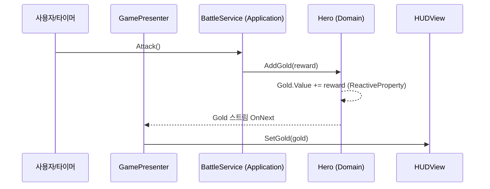

# Idle RPG — MVP Pattern Basic Structure

레이어드 아키텍처 + MVP 패턴 + 반응형 프로그래밍(UniRx) + DI(Zenject)를 적용한
방치형 RPG의 기본 구조 예제입니다.

> 학교 과제로 시작해, "게임 기능"보다 **"확장 가능한 구조를 어떻게 잡을 것인가"**에
> 초점을 맞춰 리팩터링한 개인 학습 프로젝트입니다.

---

## 1. 프로젝트 개요

| 항목 | 내용 |
|------|------|
| 장르 | 방치형(Idle) RPG — 자동 전투, 무기 드롭/장착, 스탯 업그레이드, 저장/불러오기 |
| 목표 | MVP + 레이어 분리 + DI를 실제로 굴러가는 게임에 적용해 보기 |
| 개발 인원 | 1명 (개인) |
| 엔진 | Unity 6000.3.15f1 (URP 2D) |
| 언어 | C# |

### 핵심 게임 루프
1초마다 자동으로 몬스터를 공격 → 처치 시 골드 획득 + 확률적으로 무기 드롭 →
골드로 공격력 업그레이드 / 더 강한 무기로 교체 → 다음 라운드(몬스터 체력 증가) →
50라운드 보스 처치 시 클리어.

---

## 2. 기술 스택

| 기술 | 버전 | 용도 |
|------|------|------|
| Unity | 6000.3.15f1 | 엔진 (URP 2D 템플릿) |
| [UniRx](https://github.com/neuecc/UniRx) | 6.2.2 | `ReactiveProperty` / `ReactiveCollection` 기반 상태 전파, 자동 전투 타이머 |
| [Zenject (Extenject)](https://github.com/Mathijs-Bakker/Extenject) | 9.2.0 | 생성자 주입 기반 DI, 레이어 간 결합도 제어 |
| Input System | 1.19.0 | 입력 |

---

## 3. 아키텍처

### 3.1 레이어 구조

```
Presentation ──▶ Application ──▶ Domain ◀── Infrastructure
    (View          (Service          (Entity /        (Repository
   / Presenter)   / UseCase)        Interface)         구현체)
                          ▲
                    Installers (Zenject)
                  전체 의존성을 조립(Composition Root)
```

의존성 방향은 항상 **바깥 → 안(Domain)** 으로만 흐릅니다.
`Domain`은 다른 어떤 레이어도, 외부 프레임워크도 참조하지 않는 것을 원칙으로 합니다.
(현재 상태와 한계는 [7. 회고](#7-회고--개선-방향) 참고)

### 3.2 레이어별 책임

| 레이어 | 폴더 | 책임 | 예시 |
|--------|------|------|------|
| **Domain** | `Assets/Script/Domain` | 순수 게임 규칙과 상태. 엔티티 + 저장소 인터페이스 | `Hero`, `Monster`, `Inventory`, `Weapon`, `ISaveRepository` |
| **Application** | `Assets/Script/Application` | 유즈케이스 조합. 엔티티를 엮어 "전투", "장착", "저장" 같은 흐름 구성 | `BattleService`, `EquipmentService`, `SaveService` |
| **Infrastructure** | `Assets/Script/Infrastructure` | 저장소 인터페이스의 실제 구현 (파일 I/O, 데이터 테이블) | `JsonSaveRepository`, `CsvSaveRepository`, `WeaponDatabase` |
| **Presentation** | `Assets/Script/Presentation` | MVP의 V와 P. View는 UI 출력만, Presenter가 Service ↔ View 중계 | `HUDView` / `GamePresenter`, `InventoryView` / `InventoryPresenter` |
| **Installers** | `Assets/Script/Installers` | Zenject 바인딩. 모든 레이어를 조립하는 유일한 지점 | `GameInstaller` |

### 3.3 MVP 데이터 흐름 (예: 골드가 바뀌면 HUD가 갱신된다)



- **View는 로직을 모릅니다.** `HUDView`는 `SetGold(int)` 같은 "그려라" 메서드만 가짐.
- **Presenter는 상태를 안 가집니다.** Service의 `ReactiveProperty`를 구독해 View 메서드로 넘길 뿐.
- **Service/Domain은 Unity UI를 모릅니다.** 누가 구독하는지 신경 쓰지 않고 상태만 바꿈.

### 3.4 의도적으로 보여주려 한 설계 포인트

**① 의존성 역전 (DIP) — 저장 방식 교체**

`SaveService`는 `ISaveRepository` 인터페이스에만 의존합니다.
JSON ↔ CSV 저장 전환은 `GameInstaller`의 **한 줄**로 끝납니다.

```csharp
// Assets/Script/Installers/GameInstaller.cs
Container.Bind<ISaveRepository>().To<JsonSaveRepository>().AsSingle();
// → .To<CsvSaveRepository>() 로 바꾸기만 하면 됨. Service 코드는 그대로.
```

**② 도메인 엔티티 ↔ 직렬화 DTO 분리**

`Weapon`(런타임 엔티티)과 `WeaponData`(저장용 평면 구조)를 나눠,
저장 포맷이 바뀌어도 게임 로직이 영향받지 않도록 했습니다.

**③ 반응형 상태 전파**

`Hero.Gold`, `Monster.CurrentHp`, `BattleService.CurrentRound` 등을 `ReactiveProperty`로 두어,
"값이 바뀌면 UI가 따라온다"를 이벤트 수동 배선 없이 구독으로 처리합니다.

---

## 4. 폴더 구조

```
Assets/
├── Script/
│   ├── Domain/
│   │   ├── Entities/          # Hero, Monster, Inventory, Item, Weapon, Equipment ...
│   │   └── Interfaces/        # ISaveRepository, IInventoryRepository
│   ├── Application/           # BattleService, EquipmentService, InventoryService,
│   │                          #   UpgradeService, ItemDropService, SaveService
│   ├── Infrastructure/        # JsonSaveRepository, CsvSaveRepository,
│   │                          #   InventoryRepository, WeaponDatabase
│   ├── Presentation/
│   │   ├── Views/             # HUDView, InventoryView, EquipmentView, SettingsView ...
│   │   └── Presenters/        # GamePresenter, InventoryPresenter, EquipmentPresenter ...
│   └── Installers/            # GameInstaller (Zenject Composition Root)
├── Scenes/
│   └── SampleScene.unity      # 메인 씬
└── Plugins/                   # UniRx, Zenject (서드파티)
```

---

## 5. 실행 방법

1. **Unity 6000.3.15f1** 로 프로젝트를 엽니다. (버전이 다르면 업그레이드 프롬프트가 뜰 수 있습니다.)
2. `Assets/Scenes/SampleScene.unity` 를 엽니다.
3. Play 버튼을 누릅니다.
4. 자동 전투가 시작됩니다. 상단 HUD에서 라운드/골드/공격력/몬스터 HP를 확인하고,
   버튼으로 업그레이드 · 인벤토리 · 장비 · 저장/불러오기를 조작합니다.

> 저장 파일 위치: `Application.persistentDataPath` (`save.json`, `inventory.json`, `equipment.json`)

---

## 6. 주요 클래스 빠르게 보기

| 클래스 | 레이어 | 한 줄 설명 |
|--------|--------|-----------|
| `BattleService` | Application | 라운드 진행, 몬스터 스폰, 공격/처치/보상 처리 |
| `EquipmentService` | Application | 무기 장착/해제, 총 공격력 = 기본 + 무기 계산 |
| `ItemDropService` | Application | 처치 시 확률 테이블 기반 무기 드롭 |
| `SaveService` | Application | GameData + 인벤토리 + 장비 저장/복원 오케스트레이션 |
| `WeaponDatabase` | Infrastructure | 무기 5종의 스탯/드롭률 정적 테이블 |
| `JsonSaveRepository` / `CsvSaveRepository` | Infrastructure | `ISaveRepository` 의 교체 가능한 두 구현 |
| `GamePresenter` | Presentation | 전투/스탯 상태를 HUD에 반영 |
| `AutoAttackRunner` | Presentation | 1초 간격 `Observable.Interval` 로 자동 공격 트리거 |
| `GameInstaller` | Installers | 모든 바인딩을 정의하는 단일 조립 지점 |

---

## 7. 회고 — 개선 방향

이 프로젝트에서 얻은 것과, 다음 단계로 잡아둔 개선 항목을 정리합니다.
(구조 학습이 목적이었기 때문에 일부는 의도적으로 단순하게 남겨두었습니다.)

### 배운 점
- **레이어를 나누면 테스트 가능한 코드가 된다** — `Domain`이 Unity에 거의 의존하지 않으니
  `UpgradeService`, `Inventory`, `Monster` 는 이론상 에디터 없이 순수 C#으로 검증 가능한 형태입니다.
  (단위 테스트 도입은 [다음 단계](#다음-단계-우선순위-순) 참고)
- **DI 컨테이너는 "조립 지점을 한 곳으로 모으는" 도구** — 의존이 늘어나도
  각 클래스 생성자만 보면 무엇이 필요한지 드러납니다.
- **반응형은 UI 배선 코드를 크게 줄여준다** — 대신 구독 수명 관리라는 새 책임이 생깁니다.

### 완료된 개선

- **Zenject 생명주기 인터페이스 채택** — 커스텀 `Construct()` + 수동 `Initialize()` 를
  걷어내고 모든 Presenter/Runner를 `IInitializable`/`IDisposable` 로 전환,
  `BindInterfacesAndSelfTo` 로 바인딩. 이제 컨테이너가 `Initialize()` 호출과
  씬 종료 시 `Dispose()` (구독 해제) 를 보장합니다. `EquipmentService` 도 동일 적용.
- **구독 누수 정리** — `ClearPresenter`/`SavePresenter` 의 `.AddTo()` 누락 보완,
  `GamePresenter` 의 몬스터 체력 구독을 `Switch` 로 바꿔 라운드마다 누적되던 구독 제거.
- **직렬화 DTO 이름 충돌 제거** — `Domain.Entities` 에 있던 죽은 `ItemData`/`EquipmentData`
  (Infrastructure 쪽과 이름만 겹치고 아무도 안 쓰던 코드) 삭제. 직렬화 DTO는 `Infrastructure` 로 일원화.

### 다음 단계 (우선순위 순)

| # | 항목 | 이유 |
|---|------|------|
| 1 | **레이어별 Assembly Definition 분리** | 지금은 전부 `Assembly-CSharp` 한 덩어리. asmdef를 쪼개면 "Presentation이 Domain을 직접 참조 못 한다" 같은 규칙이 **컴파일 단계에서 강제**됨 |
| 2 | **도메인 단위 테스트 도입** | `Domain`/`Application` 은 순수 C#이라 검증하기 좋은 형태. 단, 별도 Test asmdef가 참조할 대상 어셈블리가 필요하므로 #1(asmdef 분리)이 선행되어야 함 |
| 3 | **`Domain`에서 UnityEngine 제거** | `Item`/`Equipment` 의 `Debug.Log`, `Weapon.GetRarityColor()`(→ `Color` 반환) 등 표현 관심사가 도메인에 섞여 있음 |
| 4 | **Presenter 비대화 해소** | `EquipmentPresenter` 의 "최강 무기 탐색" 로직이 `Inventory`/`EquipmentService` 와 3중 중복. Service로 일원화하고 Presenter는 얇게 |
| 5 | **밸런스 수치를 ScriptableObject로** | 보스 라운드 `50`, HP 공식 `round²×10`, 업그레이드 비용 `atk×10` 등 매직 넘버를 데이터로 분리 |
| 6 | **디버그 로그 정리 / 로깅 추상화** | 프로덕션 경로에 `Debug.Log` 가 과다. 조건부 컴파일 또는 `ILogger` 도입 |
| 7 | **루트 네임스페이스 도입** | `namespace Application` 이 `UnityEngine.Application` 과 충돌해 풀네임을 강제함 |

### 알려진 이슈
- 배속 슬라이더(`Time.timeScale`)가 `AutoAttackRunner`의 `Observable.Interval` 에는
  반영되지 않음 — `Scheduler.MainThreadScaled` 로 교체 예정.
- `StatisticsView` 는 아키텍처에 연결되지 않은 잔여 코드.

---

## 8. 라이선스

학습용 개인 프로젝트입니다. 서드파티 플러그인(UniRx, Zenject)은 각자의 MIT 라이선스를 따릅니다.
